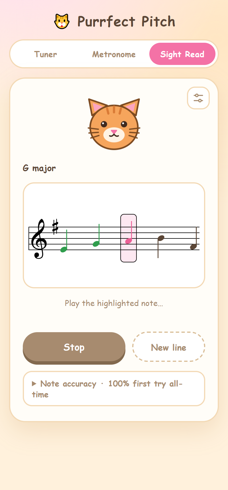

# Tuner, Metronome & Sight Reading

**[▶ Live demo](https://pinardy.github.io/purrfect-pitch/)**

<p align="center">
  
</p>

An installable PWA (React + TypeScript + Vite) with three tools you can toggle between:

- **Tuner** — chromatic tuner using the microphone and autocorrelation pitch
  detection. The A4 reference pitch is adjustable (400–480 Hz, e.g. 442 Hz)
  via the settings sheet and is persisted across sessions.
- **Metronome** — Web Audio lookahead scheduler for drift-free clicks, with
  tempo control (30–240 BPM via slider, nudge buttons, and tap tempo), beats
  per bar with an accented downbeat, and a visual beat indicator.
- **Sight Read** — random notation rendered with VexFlow in a random key
  (signature-aware, with chromatic accidentals on hard difficulty); the mic
  listens while you play and the cursor advances when you hit the right pitch.
  Correct notes turn green (orange if you missed first), wrong attempts flash
  red, and a first-try score is tallied per line. Difficulty, key mode, notes
  per line, and strict ±30¢ intonation are configurable and persisted. It
  shares the tuner's A4 reference and microphone preference. Pitch detection
  is monophonic — play single notes.

## Development

```sh
npm install
npm run dev
```

## Production build

```sh
npm run build
npm run preview
```

## Deploy to GitHub Pages

Deployment is automatic: every push to `main` triggers the
`.github/workflows/deploy.yml` workflow, which builds the app and publishes it
straight to GitHub Pages (no `gh-pages` branch). The site is served at
https://pinardy.github.io/purrfect-pitch/. The workflow can also be run
manually from the Actions tab via **Run workflow**.

The service worker and manifest are generated by `vite-plugin-pwa` during the
build. Note that microphone access (and PWA installation) requires a secure
context: `localhost` in development or HTTPS in production.

`npm run icons` regenerates the PNG icons in `public/` from
`scripts/generate-icons.mjs`.
